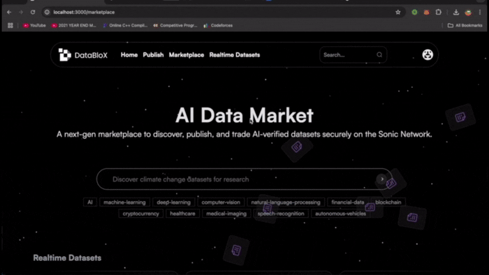

# DataBlox - The Zerepy powered Data Intelligence Hub

  
  
<strong>Watch our video</strong>

## 📚 Table of Contents

- [🌟 Inspiration](#-inspiration)
- [🚀 What It Does](#-what-it-does)
- [🔥 How DataBlox Delivers Real-Time Data](#-how-datablox-delivers-real-time-data)
- [🛒 AI Powered Data Marketplace](#-ai-powered-data-marketplace)
  - [👤 Buyer](#-buyer)
  - [🏷️ Seller](#-seller)
  - [🔁Complete Workflow: How Everything Connects](#complete-workflow-how-everything-connects)
- [⚡ Technologies Used](#-technologies-used)
- [🏆 Why DataBlox?](#-why-datablox)
- [🔮 Future Enhancements](#-future-enhancements)
- [🔗 Join the Future of Data Intelligence](#-join-the-future-of-data-intelligence)
- [👥 Contributors](#contributors)

## 🌟 Inspiration

🚀 Imagine you’re a marketer for Nike, launching a new sneaker. The campaign is live, but without real-time Twitter data, you’re flying blind — unable to see 👥 which age groups are most excited, 🌍 which regions are driving demand, or 📈 when an influencer’s tweet causes a viral spike. If negative feedback starts trending on Twitter, ⚠️ you might react too late to prevent a PR crisis. And all the while, 💸 ad budgets could be wasted targeting the wrong audiences. In a fast-paced market, every second counts — and without live Twitter insights, you risk falling behind. ⏱️🔥

Or imagine a researcher buying a dataset to train their ML model, only to face setbacks — 🔍 no way to verify quality before buying, 📉 missing key features, 🛠️ messy structures, and ⏳ hours wasted fixing or abandoning bad data. In a fast-paced world, these delays cost more than just time. 🚀

This is where **DataBlox** changes the game. We’ve built a solution that ensures real-time accuracy and trust in data acquisition. No more outdated insights. No more blind purchases. Just the data you need—when you need it. 🚀

## 🚀 What It Does

**DataBlox** is a **decentralized, AI-powered data marketplace** that combines two key functions:
- **Realtime Datasets**
- **AI Powered Data Marketplace**

## 🔥 How DataBlox Delivers Real-Time Data

Imagine you need to track live conversations, sentiment shifts, or viral trends as they happen. With **DataBlox**, you can request, access, and continuously receive real-time datasets — fully structured and ready to use.

### Here’s how it works:

1. **🚀 Request & Define Your Data Needs:**  
   Search for an existing dataset or create a custom request. For example, you can track sentiment around a product launch by adding relevant Twitter handles, hashtags, or keywords, then submitting your request.

2. **🤖 AI Agents Collect & Structure Data:**  
   Once your request is submitted, **DataBlox’s AI agents** fetch live Twitter data, analyze sentiment, detect trends, and extract key insights. They organize the information into structured categories like trends, regions, and demographics, turning raw social data into a clean, usable dataset.

3. **📩 Get Your Webhook & Live Updates:**  
   Within **2–3 days**, you’ll receive a webhook URL. **Zerepy agents** continuously monitor your requested accounts, hashtags, and topics, instantly appending new data to your dataset and updating your webhook in real-time.

4. **📈 Seamlessly Integrate & Automate:**  
   Plug your **webhook** into ML models, dashboards, trading strategies, or BI tools. Your system stays updated automatically, giving you continuous, real-time insights without any manual work.

Every new data point flows into your system without manual intervention, keeping your insights always current. 🚀

  

## 🛒 AI Powered Data Marketplace

### 👤 Buyer

- **🔍 Seamless Onboarding & Smart Search**  
  Connect your wallet and enter a natural language query—no need for complex filters or technical know-how. Our AI-powered search engine automatically extracts relevant tags and metadata, presenting you with a curated list of high-quality, verified datasets—whether you need real-time health metrics, e-commerce trends, or behavioral insights.

- **🤖 Interactive Quality Verification**  
  Before purchasing, chat with our AI assistant to assess dataset quality. Ask about missing values, data freshness, consistency, or biases, and our **credibility & security agents** will provide detailed insights—ensuring you invest in only the most reliable data.

- **🔗 Secure & Transparent NFT Transactions**  
  When ready, purchase datasets as **burnable NFTs** on the **Sonic blockchain**. This ensures secure, time-limited access, with every transaction immutably recorded—guaranteeing transparency, ownership, and seamless integration into your workflow. 🚀

  

### 🏷️ Seller

- **📤 Effortless Dataset Listing for Sellers**  
  Have a valuable dataset to offer? Simply connect your wallet and list it on the marketplace. Our AI agents help you categorize and tag your dataset for better discoverability. Add descriptions, sample previews, and pricing—all through a user-friendly interface.

- **🧠 AI-Backed Quality Boost & Visibility**  
  Our platform evaluates your dataset using credibility and consistency checks, boosting your listing’s trust factor. Verified datasets get better visibility, increasing buyer confidence and sales potential.

- **💸 Earn via Sonic Tokens**  
  Every sale earns you **Sonic tokens**, while the **burnable NFT mechanism** ensures fair usage rights and transparent access. Whether you're an individual contributor or a data-rich organization, monetizing your datasets has never been this simple.

  

**🔁Complete Workflow: How Everything Connects**

  

## ⚡ Technologies Used

- **Sonic Blockchain:** Secure, decentralized transactions and immutable dataset ownership.
- **Zerepy AI:** The engine behind our live data fetching, processing, and continuous updates.
- **Next.js & Supabase:** Powering a fast, scalable front-end and robust backend.
- **Groq & Gemini AI:** Advanced tools for data extraction, sentiment analysis, and insight generation.
- **Smart Contracts & Burnable NFTs:** Ensure secure, time-limited access to purchased datasets.

## 🏆 Why DataBlox?

- **Real-Time, AI-Powered Insights:** Stay ahead with continuously updated, actionable data.
- **Decentralized & Secure:** Blockchain-based transactions ensure transparency and trust.
- **Customizable Data Solutions:** Tailor your dataset requests to match exact needs.
- **User-Friendly Marketplace:** Discover, verify, and purchase quality datasets with ease.

## 🔮 Future Enhancements

- **Broader Social Media Integration:** Expand data sources beyond Twitter to include platforms like LinkedIn.
- **Advanced Trend Predictions:** Develop AI models to forecast emerging trends and market shifts.
- **Automated Resale Marketplace:** Enable secure, automated resale of datasets.
- **Mobile Application:** Bring real-time data intelligence to your fingertips on-the-go.

## 🔗 Join the Future of Data Intelligence

Experience the revolution in data access and intelligence. Whether you're a **business optimizing campaigns, a researcher mining insights, or a developer powering next-gen applications, DataBlox empowers you with verified, real-time data.**

### Website: [DataBloX](#)
# Contributors

The following individuals have contributed to this project:

### 1. [Umesh Singh Verma](https://github.com/umeshSinghVerma)

- **Role:** AI Engineer
- **Responsibilities:** Designed and integrated AI agents to automate data structuring and insights.

### 2. [Akhilesh Jyotishi](https://github.com/AkhileshJyotishi)

- **Role:** Full Stack Developer
- **Responsibilities:** Developed key frontend components and built the backend to power the platform.

### 3. [Disha Dwivedi](https://github.com/Dis1309)

- **Role:** Blockchain Developer
- **Responsibilities:** Developed and deployed secure smart contracts for NFT-based data transactions.

### 4. [Ankit Yadav](https://github.com/ANKITy102)

- **Role:** Frontend Developer
- **Responsibilities:** Built the core UI and seamlessly integrated backend APIs for a smooth user experience.

### 5. [Shubham Roy](https://github.com/sr2005roy)

- **Role:** Frontend Developer
- **Responsibilities:** Designed website , fixed bugs , resolved deployment .

---

**DataBlox – Because in a world that never stops moving, your data shouldn’t either.** 🚀
